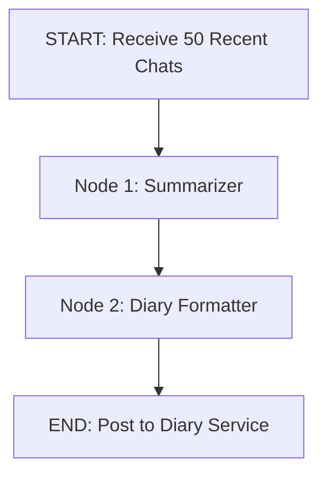

# Agent Service

The `agent-service` is a standalone LangGraph-based microservice for `dearai-backend`. It handles processing the user's conversation to extract an emotional summary and converting it into a diary entry.

## Setup

For instructions on how to configure the Vertex AI model and authentication, please refer to Section 9 of the `gcp.md` documentation in the project root.

## Usage

The agent exposes a single internal endpoint:
`POST /summarize-to-diary`

**Headers required**:
- `X-Internal-Auth`: Your PASETO internal token.

## Architecture & Workflow

The Agent Service is built using [LangGraph](https://python.langchain.com/docs/langgraph) to create a robust, stateful pipeline for processing conversation history. It operates as a directed acyclic graph (DAG) where each node represents a specific AI processing step.

### Decision Tree & Execution Steps

Currently, the agent follows a linear, two-step decision tree to process chats into a diary entry:



1. **Step 1: The Summarizer Node (`summarizer`)**
   - **Input**: The raw chat history (up to 50 messages) formatted as user/assistant roles.
   - **Task**: The LLM (e.g., Gemini 3.1 Flash) analyzes the conversation to extract the core emotional state, key life events, and underlying sentiments expressed by the user.
   - **Output**: An `emotional_summary` string that captures the psychological and factual essence of the chat.

2. **Step 2: The Diary Formatter Node (`diary_formatter`)**
   - **Input**: The `emotional_summary` generated by the previous node.
   - **Task**: The LLM takes the clinical/objective summary and transforms it into a warm, empathetic, first-person (or companion-perspective) diary entry. It also generates a concise `diary_title`.
   - **Output**: The finalized `diary_title` and `diary_content`.

3. **Step 3: Persistence**
   - The compiled state is returned to the FastAPI endpoint, which then securely posts the generated entry to the `diary-service` via an internal HTTP call.

### Agent State
Throughout the graph execution, the agent maintains a typed `DiaryAgentState` containing:
- `chats`: List of messages
- `emotional_summary`: Extracted state
- `diary_title`: The generated title
- `diary_content`: The finalized entry text

## Local Development

If you prefer to run it locally without Docker:
```bash
uv pip install -e .
uvicorn app.main:app --reload
```
